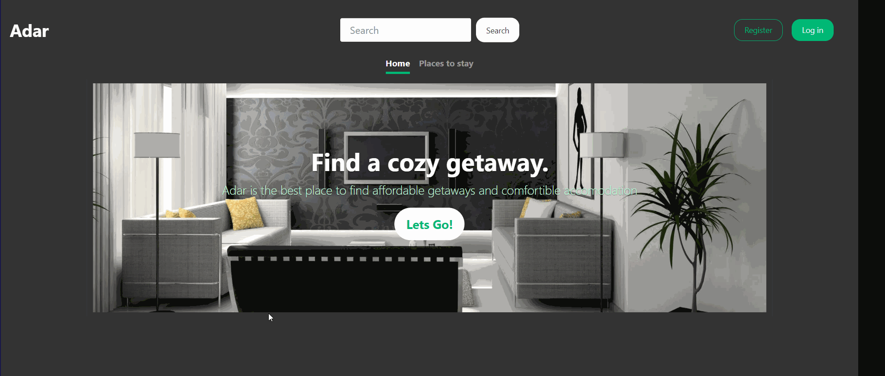

# ADAR

ADAR is a house renting web application that provides a digital platform for users to rent affordable housing for short periods of time.



## Getting Started

These instructions will get you a copy of the project up and running on your local machine.

### Prerequisites

- [.NET Framework](https://dotnet.microsoft.com/download/dotnet-framework)
- [IDE (Preferably Visual Studio)](https://visualstudio.microsoft.com/)
- [Microsoft SQL Server](https://www.microsoft.com/en-us/sql-server/sql-server-downloads)

## Usage

1. Clone the repository
1. Start Visual Studio.
1. On the menu bar, choose File -> Open -> Project.
1. Specify location of the project.
1. Modify the **Data Source** , **Catalog** , **User Id**  and **Password** values of the connection string found in `./Web.congig` to the server name, database name, username and password of your SQL Server
1. Click the Run button or press F5 key to execute the project.

### Modifying the connection string values

```c#
<connectionStrings>
    <add name="DefaultConnection" connectionString="Data Source=LIUL-PC;Initial Catalog=AdarDatabase;Integrated Security=False;User Id=testuser;Password=password;MultipleActiveResultSets=True" providerName="System.Data.SqlClient" />
  </connectionStrings>
```

